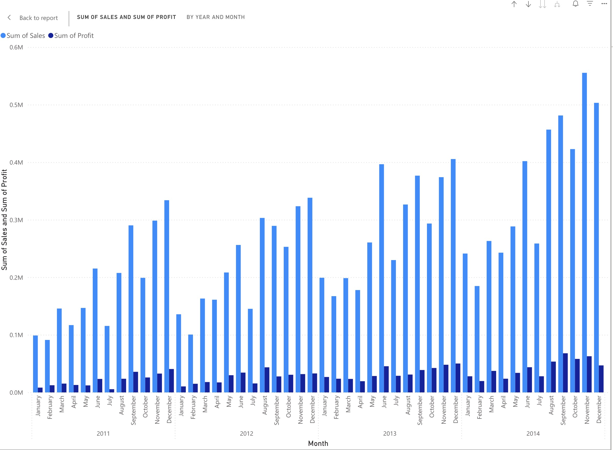
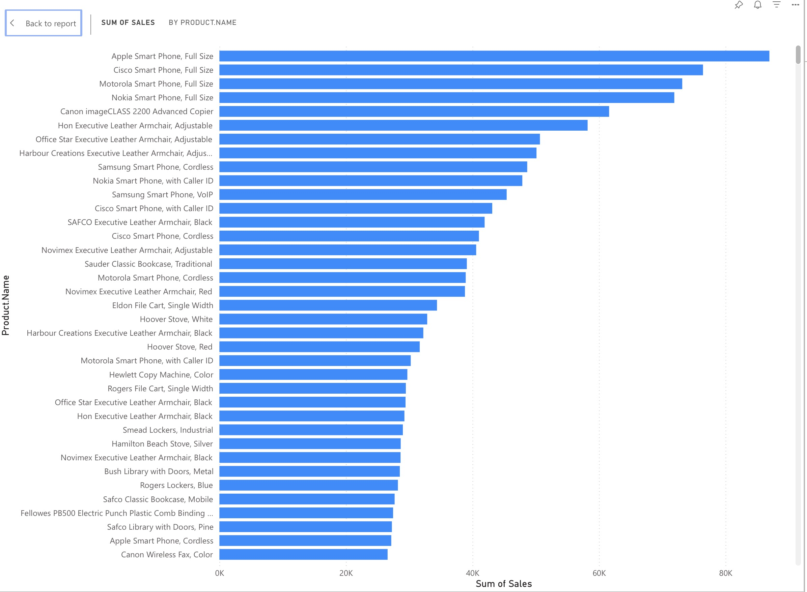
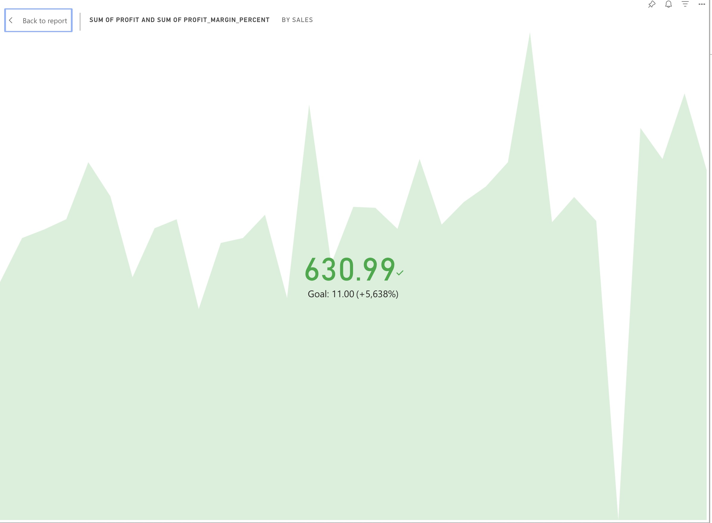

# Automated Sales Dashboard

## 📌 Project Overview
This project is an **Automated Sales Dashboard** built using **Power BI**, **PostgreSQL**, and **Python** (ETL pipeline). It automates data extraction, transformation, and loading (ETL) from a structured sales dataset, allowing for real-time sales insights, profit analysis, and trend visualization.

## 🚀 Features
- **Automated ETL Pipeline**: Extract, transform, and load sales data from a CSV file into PostgreSQL.
- **Power BI Dashboard**: Visualize key business metrics such as **Total Sales, Profit Margins, and Customer Segmentation**.
- **Data Transformation**: Includes **profit margin calculation, sales categorization, and processing time analysis**.
- **AI-Powered Insights**: Enhances analytics using **AI-driven forecasting and anomaly detection**.

## 🏗️ Tech Stack
- **Power BI** (Data Visualization)
- **PostgreSQL** (Database Management)
- **Python (pandas, psycopg2, NumPy)** (ETL Processing)
- **FastAPI** (For API integrations)
- **Docker** (Optional for deployment)

---

## 📂 Project Structure
```
📦 Automated-Sales-Dashboard
├── 📂 data                  # Raw & transformed dataset storage
├── 📂 etl                   # ETL scripts
│   ├── extract.py           # Extracts data from CSV
│   ├── transform.py         # Data cleaning and transformation
│   ├── load.py              # Inserts data into PostgreSQL
│   ├── database
│   │   ├── db.py            # Database connection setup
│   │   ├── create_table.py  # Table schema creation
├── 📜 .env                   # Environment variables (DB config)
├── 📜 requirements.txt       # Python dependencies
├── 📜 README.md              # Project documentation
```

---

## ⚡ Setup & Installation

### 1️⃣ Prerequisites
- **Python 3.10+**
- **PostgreSQL** (Local or Cloud Instance)
- **Power BI (Web/Desktop)**
- **Git**

### 2️⃣ Clone the Repository
```sh
git clone https://github.com/zaidchaudhrry/Automated-Sales-Dashboard.git
cd Automated-Sales-Dashboard
```

### 3️⃣ Set Up Virtual Environment & Install Dependencies
```sh
python -m venv .venv
source .venv/bin/activate  # On Windows: .venv\Scripts\activate
pip install -r requirements.txt
```

### 4️⃣ Configure Database & Environment Variables
Create a `.env` file in the root directory and add:
```env
DB_HOST=localhost
DB_NAME=powerbi_db
DB_USER=postgres
DB_PASSWORD=yourpassword
DB_PORT=5432
```

### 5️⃣ Run the ETL Pipeline
```sh
# Create database table
python etl/database/create_table.py

# Extract and transform data
python etl/transform.py

# Load data into PostgreSQL
python etl/load.py
```

### 6️⃣ Connect Power BI to PostgreSQL
1. **Go to Power BI Web**
2. **Choose PostgreSQL as a data source**
3. **Enter database credentials**
4. **Load the transformed data and build visualizations**

---

## 📊 Power BI Dashboard
### **Key Insights in the Dashboard:**

#### 🏆 **Total Sales and Profit by Year and Month**


#### 📦 **Total Sales by Product**


#### 📈 **KPI Metrics**

---

## 🛠️ Future Enhancements
- 🔹 **AI-based Forecasting** (Using Prophet or LSTMs)
- 🔹 **Real-time Data Streaming** (Kafka Integration)
- 🔹 **Automated Email Reports** (Power Automate)
- 🔹 **Cloud Deployment** (AWS RDS + Power BI Service)

---

## 📜 License
This project is **MIT licensed**. You are free to use and modify it as needed.

---

## 🤝 Contributing
Pull requests are welcome! For major changes, open an issue first to discuss what you’d like to modify.

---

## 📬 Contact
For any inquiries, reach out via **[GitHub Issues](https://github.com/zaidchaudhrry/Automated-Sales-Dashboard/issues)** or email **zaidchaudhrry@gmail.com**.

---


